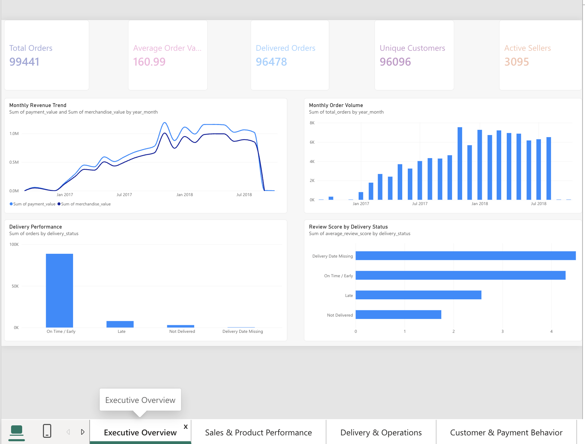
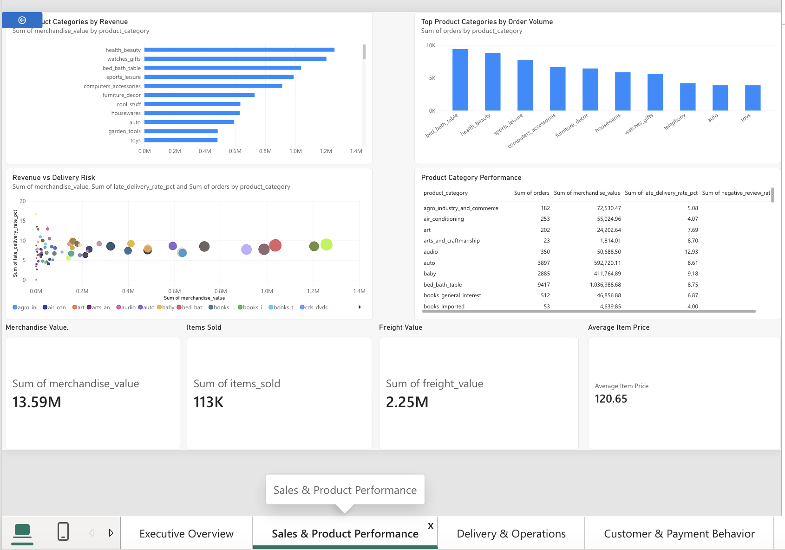
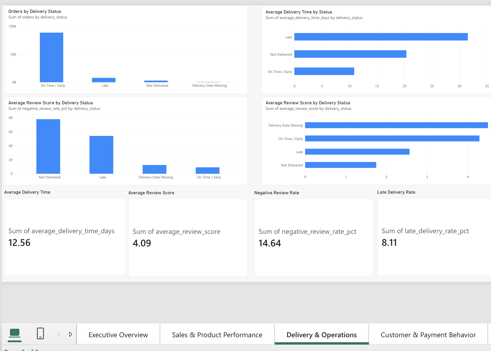
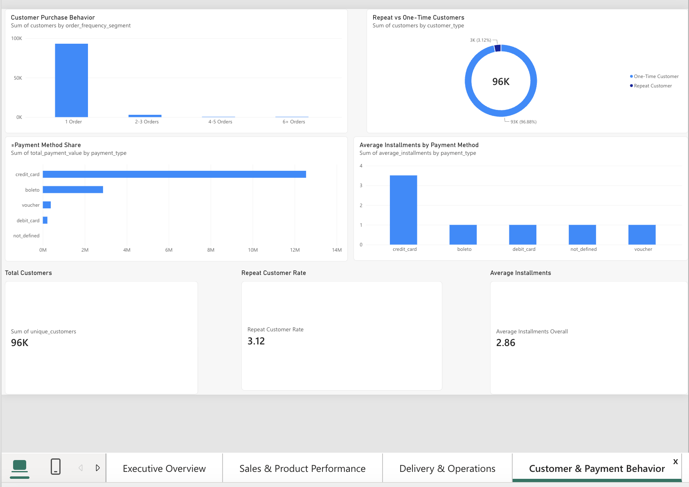
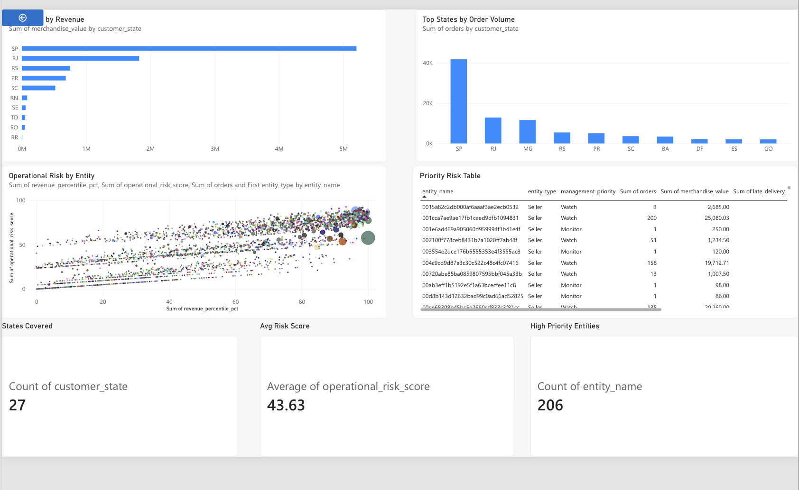

# Retail Analytics Control Tower

[](https://github.com/sriyukthasakhamuri/accenture-retail-control-tower/actions/workflows/data-quality.yml)

An end-to-end retail analytics and data engineering project that transforms raw e-commerce data into validated, analytics-ready datasets, advanced SQL insights, and interactive Power BI dashboards.

The platform supports business decisions across sales, customer behavior, delivery performance, payment patterns, geographic trends, and operational risk.

## Project Overview

The Retail Analytics Control Tower combines Python, Pandas, SQL, DuckDB, Power BI, pytest, and GitHub Actions to create a reproducible analytics workflow.

**Key capabilities:**

* Automated data processing and dimensional modeling
* Data quality validation and financial reconciliation
* Advanced SQL reporting with window functions
* Business KPI analysis and operational risk prioritization
* Five interactive Power BI dashboard pages
* Automated data-quality testing through GitHub Actions CI

## Tech Stack

| Category              | Technologies                  |
| --------------------- | ----------------------------- |
| Programming           | Python, SQL                   |
| Data Processing       | Pandas                        |
| Analytics Database    | DuckDB                        |
| Data Modeling         | Fact Tables, Dimension Tables |
| Business Intelligence | Power BI                      |
| Automated Testing     | pytest                        |
| CI/CD                 | GitHub Actions                |
| Version Control       | Git, GitHub                   |

## Project Architecture

```text
Raw E-Commerce CSV Data
          |
          v
Python Data Processing
          |
          v
Fact & Dimension Modeling
          |
          v
Data Validation & Reconciliation
          |
          v
DuckDB Analytics Database
          |
          v
Advanced SQL Business Analysis
          |
          v
Power BI Management Dashboards
```

**Automated quality assurance:**

```text
GitHub Push / Pull Request
          |
          v
GitHub Actions CI
          |
          v
Install Python Dependencies
          |
          v
Prepare Sample Test Data
          |
          v
Execute Analytics Pipeline
          |
          v
Build DuckDB Database
          |
          v
Run 30 Automated Quality Tests
          |
          v
CI Pass / Fail Result
```

## Key Business KPIs

| Metric                |      Value |
| --------------------- | ---------: |
| Total Orders          |     99,441 |
| Delivered Orders      |     96,478 |
| Unique Customers      |     96,096 |
| Active Sellers        |      3,095 |
| Total Payment Value   |    $16.01M |
| Average Order Value   |    $160.99 |
| Average Delivery Time | 12.56 days |
| Late Delivery Rate    |      8.11% |
| Average Review Score  |       4.09 |
| Negative Review Rate  |     14.64% |

*These KPIs describe the full analytics dataset. The CI workflow uses a smaller sample dataset for automated validation.*

## Key Business Insights

* Late deliveries were strongly associated with lower customer satisfaction.
* Late orders had an average review score of approximately **2.57**, compared with **4.29** for on-time or early deliveries.
* Negative review rates were substantially higher for late deliveries.
* Credit cards accounted for the majority of payment value.
* Repeat customer rate was approximately **3.12%**.
* Revenue and order activity were concentrated in a relatively small number of states.
* Operational risk scoring helped identify high-priority sellers, product categories, and customer states.

## Power BI Dashboards

### 1. Executive Overview



### 2. Sales & Product Performance



### 3. Delivery & Operations



### 4. Customer & Payment Behavior



### 5. Geographic & Risk Control Tower



## Dimensional Data Modeling

The analytics database uses fact and dimension tables to support consistent business reporting.

**Fact tables:**

* `fact_orders`
* `fact_order_items`
* `fact_payments`
* `fact_reviews`

**Dimension tables:**

* `dim_customer`
* `dim_product`
* `dim_seller`
* `dim_geography`
* `dim_date`

The date dimension supports calendar-based reporting, including months with no transaction activity.

Data validation checks help maintain consistent keys, table relationships, and financial reporting.

## Advanced SQL Analytics

The repository includes SQL analysis for:

1. Executive KPIs
2. Monthly performance
3. Product performance
4. Seller performance
5. Geographic performance
6. Customer behavior
7. Payment behavior
8. Delivery operations
9. Operational risk prioritization

### Advanced Monthly Performance Analysis

The enhanced `sql/02_monthly_performance.sql` query includes:

* Common Table Expressions (CTEs)
* Order-level aggregation to control join granularity
* `LAG()` for previous-month comparisons
* Month-over-month order and revenue growth
* Three-month moving averages
* `RANK()` for revenue-based monthly rankings
* `NULLIF()` for safe division
* Calendar-based reporting to include months with zero transactions

**Data quality improvement:** The monthly analysis uses a continuous calendar rather than assuming every month contains transactions. This prevents misleading previous-month comparisons when transaction months are missing.

## Automated Data Quality Testing

The project includes **30 automated pytest tests** covering data quality checks for the analytics model.

Validation areas include:

* Primary and composite key integrity
* Null and duplicate detection
* Referential integrity between facts and dimensions
* Data consistency and valid ranges
* Financial reconciliation
* Calendar and reporting consistency

Run the tests locally after building the analytics database:

```bash
python -m pytest tests/test_data_quality.py -v
```

**Verified local result:** 30 tests passed.

## GitHub Actions CI/CD

The project uses GitHub Actions to automatically validate the analytics pipeline when code is pushed to `main` or a pull request targets `main`.

Workflow file:

`.github/workflows/data-quality.yml`

The workflow:

1. Checks out the repository.
2. Sets up Python 3.13.
3. Installs project dependencies and pytest.
4. Prepares a small, reproducible test dataset.
5. Runs the analytics pipeline.
6. Builds the DuckDB analytics database.
7. Executes the automated data-quality tests.
8. Reports success or failure through GitHub Actions.

**Verified result:** Data Quality CI workflow #2 completed successfully.

[View GitHub Actions workflow](https://github.com/sriyukthasakhamuri/accenture-retail-control-tower/actions/workflows/data-quality.yml)

### Reproducible Test Data

The repository includes a fixture-generation script:

`tests/create_ci_fixture.py`

The sample data allows the CI workflow to test the analytics pipeline without requiring the full raw dataset.

The full raw data and generated analytics outputs are excluded from Git version control where appropriate.

## Operational Risk Model

The operational risk-prioritization analysis considers:

* Revenue exposure
* Order volume exposure
* Late delivery performance
* Negative review performance

Entities are classified into three operational monitoring categories:

| Priority      | Interpretation                        |
| ------------- | ------------------------------------- |
| High Priority | Requires closer operational attention |
| Watch         | Potential risk requiring monitoring   |
| Monitor       | Lower relative priority               |

The resulting analysis supports prioritization across sellers, product categories, and customer states.

## Repository Structure

```text
accenture-retail-control-tower/
|
|-- .github/
|   `-- workflows/
|       `-- data-quality.yml
|
|-- dashboards/
|   `-- screenshots/
|
|-- data/
|   |-- raw/
|   |-- processed/
|   `-- analytics/
|
|-- docs/
|-- notebooks/
|
|-- sql/
|   |-- 01_executive_kpis.sql
|   |-- 02_monthly_performance.sql
|   |-- 03_product_performance.sql
|   |-- 04_seller_performance.sql
|   |-- 05_geographic_performance.sql
|   |-- 06_customer_behavior.sql
|   |-- 07_payment_behavior.sql
|   |-- 08_delivery_operations.sql
|   `-- 09_operational_risk.sql
|
|-- src/
|   |-- run_pipeline.py
|   |-- build_analytics_database.py
|   `-- other processing and validation scripts
|
|-- tests/
|   |-- create_ci_fixture.py
|   |-- test_data_quality.py
|   `-- fixtures/
|
|-- .gitignore
|-- README.md
`-- requirements.txt
```

## Running the Project Locally

### 1. Clone the Repository

```bash
git clone https://github.com/sriyukthasakhamuri/accenture-retail-control-tower.git
cd accenture-retail-control-tower
```

### 2. Create a Virtual Environment

```bash
python3 -m venv .venv
source .venv/bin/activate
```

### 3. Install Dependencies

```bash
python -m pip install -r requirements.txt
python -m pip install pytest
```

### 4. Prepare Sample Data

```bash
python tests/create_ci_fixture.py
mkdir -p data/raw
cp tests/fixtures/raw/*.csv data/raw/
```

### 5. Run the Analytics Pipeline

```bash
python src/run_pipeline.py
```

### 6. Build the DuckDB Analytics Database

```bash
python src/build_analytics_database.py
```

### 7. Run Automated Tests

```bash
python -m pytest tests/test_data_quality.py -v
```

**Note:** The sample dataset is designed for pipeline and data-quality verification. The dashboard KPIs and business insights above were calculated from the full dataset.

## Engineering Highlights

* Built a multi-table dimensional analytics model for retail reporting.
* Implemented advanced SQL trend analysis with window functions and continuous-calendar reporting.
* Added automated data validation and reconciliation.
* Developed 30 pytest data-quality tests.
* Configured GitHub Actions to execute the analytics pipeline and tests on code changes.
* Created five management-focused Power BI dashboard pages.

## Project Repository

[GitHub — Retail Analytics Control Tower](https://github.com/sriyukthasakhamuri/accenture-retail-control-tower)
